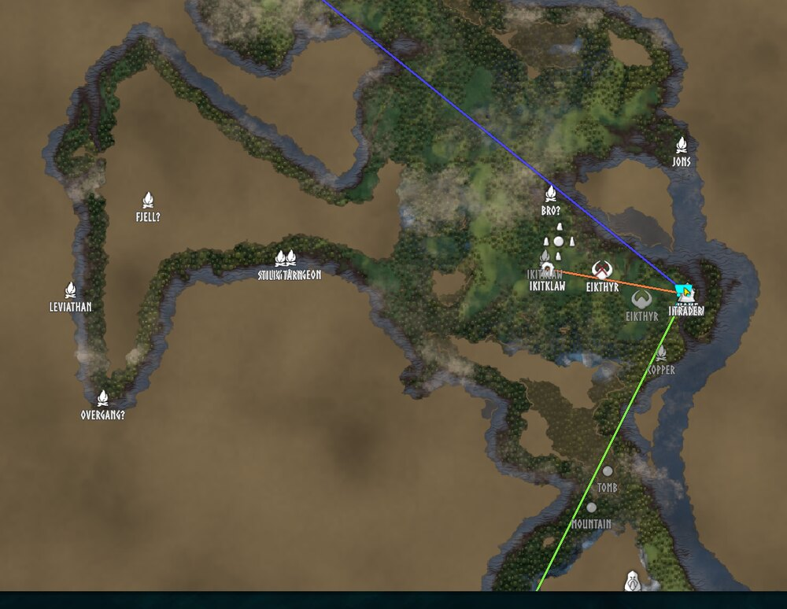
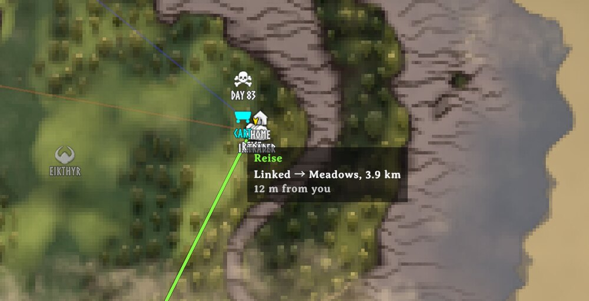
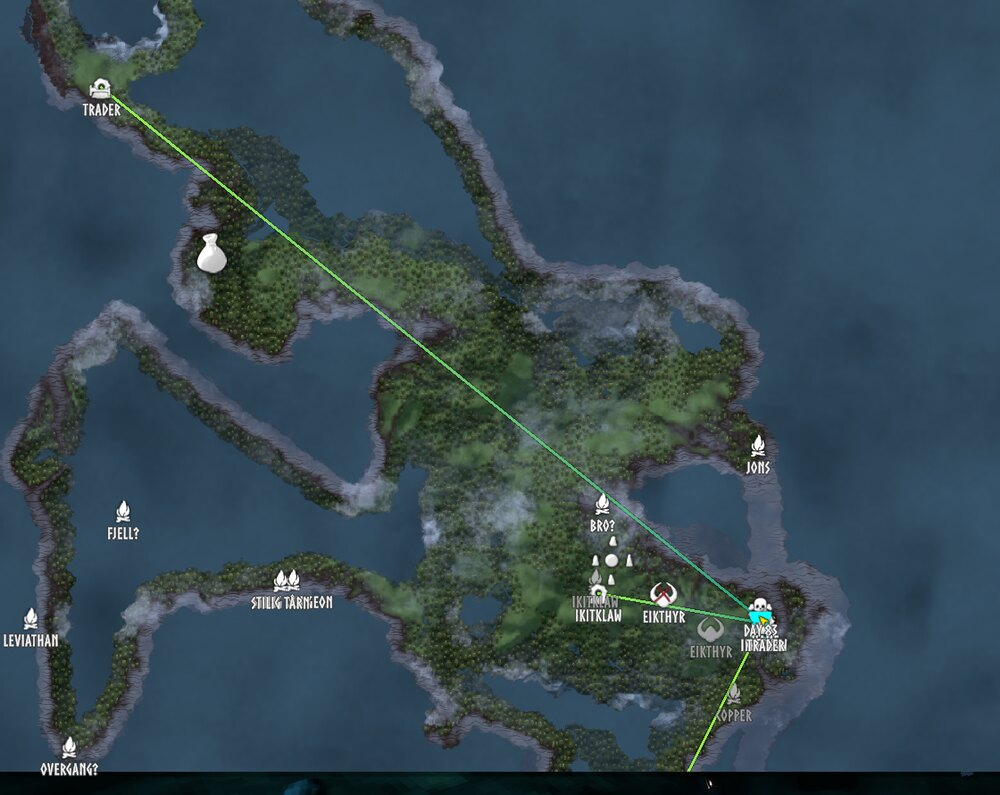
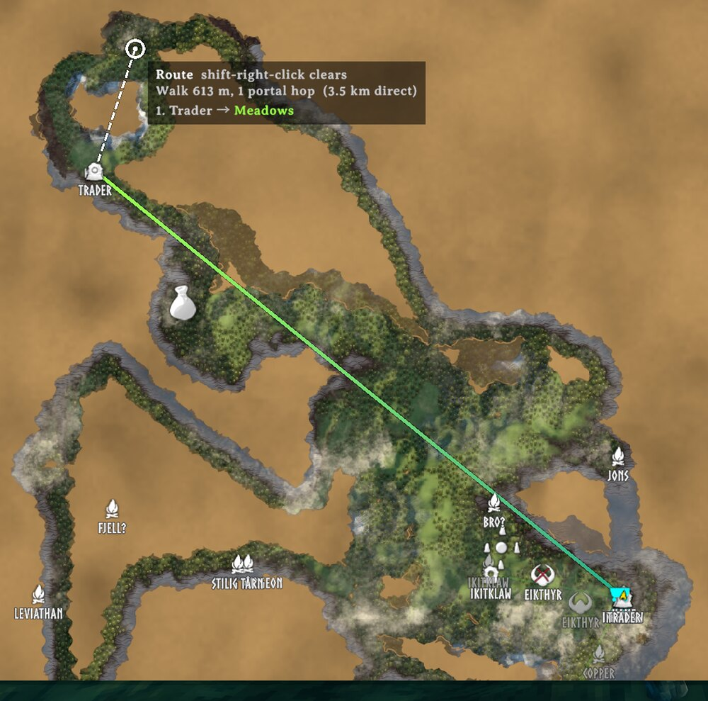

# Portal Lines

A client-side Valheim mod that draws every portal you know about on the map, with a line to the
portal it is connected to.

Built against **Valheim 1.0.12**. Requires BepInEx 5 and
[Jotunn](https://thunderstore.io/c/valheim/p/ValheimModding/Jotunn/). Nothing to install on the
server.

## Screenshots

**The network.** Every known portal, with a line to the portal it is connected to.



**Hover.** The portal's line lights up, the rest dim, and the panel says where it goes.



**Biome gradient.** Each end takes its biome's colour: lime for Meadows into teal for Black Forest.



**Route planner.** Shift-click a spot: 613 m on foot via the Trader portal instead of 3.5 km direct.



## What it does

Open the large map:

- **Lines** between each pair of connected portals, each end coloured by its biome and blended
  along the line so you can see where it goes (or per tag, or a single colour). A dashed line means the pair is not confirmed yet: either the only two known portals with
  that tag (the server pairs them within five seconds), or one end's copy is stale until the next
  refresh.
- **Pins** at every known portal with the tag as the name. Unconnected portals are tinted red;
  portals whose tag is shared by three or more (only one pair can ever connect) are tinted orange.
  The pins are never saved or shared through the cartography table, and the map's own portal icon
  filter hides them.

**Shift-click** anywhere on the map to plan the fastest way there through the portals: walk to a
portal, hop, walk on, chaining through hubs if it helps. Walking legs are dotted, hops are bright,
and a panel beside the destination shows the total on foot against the direct distance.
Shift-right-click clears the route.

Hover a portal pin to highlight its line and dim the rest, with a panel showing its tag, link
state, destination biome and distances. A "Portal lines" checkbox on the map (and an optional
hotkey) hides the lines; hovering still peeks at one portal's line while they are hidden.

## How it knows about portals

The game only sends a client the portals near it, but a client never forgets one it has received,
and it can ask the server for any portal by id — the same request the game makes for the portal
you are standing next to. So the mod knows every portal you have been near this session, plus the
far end of each one. On the hosting player's machine, or in singleplayer, it knows the whole world.

Between sessions it remembers portals on disk, per world, in `BepInEx/config/PortalLines/`. At
login every remembered portal is drawn faded, with a dashed line to where its partner was last
seen; each turns solid once a live copy arrives. A remembered portal that is missing from a
loaded area in range is forgotten: it was demolished. `ForgetAfterDays` can also age them out.

## Console

`portallines list` prints every known portal with its tag, position and link state;
`portallines links` the lines; `portallines refresh` forces a rescan; `portallines forget`
clears this world's remembered portals.

## Building

```
./build/deploy.sh                # build and copy to the r2modman profile on the rig
./build/package.sh               # Thunderstore zip in dist/
```

Reference assemblies go in `lib/` (gitignored) or point `VALHEIM_INSTALL` at a game install.

## License

MIT.
